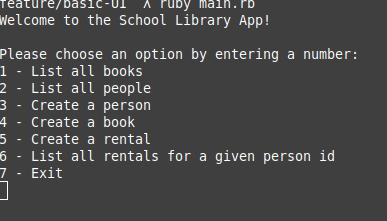
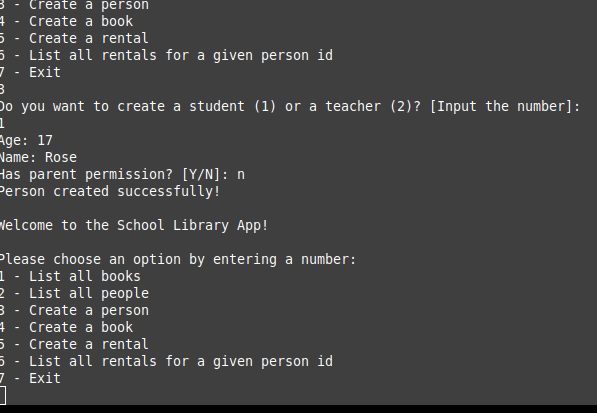
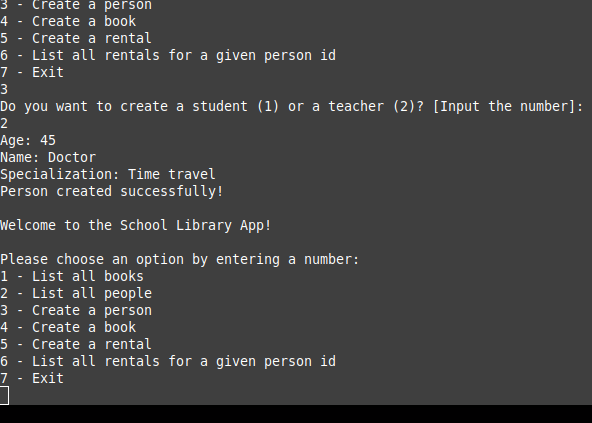
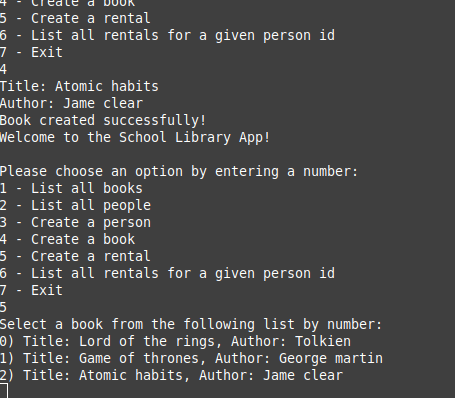

# School library

> This app is a tool one can use in a library to record what books are in the library and who borrows them. This app will allow a user to:

- Add new students or teachers.
- Add new books.
- Save records of who borrowed a book and when.

## Screenshots

> |Screenshot 1|Screenshots 2|
> |--------------|----------------|
> |||!
> |Screenshot 3|Screenshots 4|
> |--------------|----------------|
> |||!


Additional description about the project and its features.

## Built With

- Ruby


## Getting Started


To get a local copy up and running follow these simple example steps.

### Prerequisites
```
Ruby
```

### Setup
```
git clone git@github.com:Tchilo/school-library-oop.git
cd school-library-oop.git
```

### Run Program
```
ruby main.rb
```


## Author

👤 **Taro Chilongoshi**

- GitHub: [@githubhandle](https://github.com/Tchilo)
- LinkedIn: [LinkedIn](https://linkedin.com/in/TaroChilongoshi)


## 🤝 Contributing

Contributions, issues, and feature requests are welcome!

Feel free to check the [issues page](../../issues/).

## Show your support

Give a ⭐️ if you like this project!

## Acknowledgments

- Hat tip to anyone whose code was used
- Inspiration
- etc

## 📝 License

This project is [MIT](./MIT.md) licensed.
